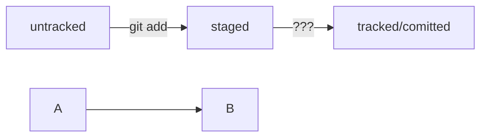

# Учебный проект

---


## Тренируюсь работать с GitHub

Вот так оформляется код:

```html
<h1>А я просто текст</h1>
``` 

### HEAD

Файл HEAD (англ. «голова», «головной») — один из служебных файлов папки .git. Он указывает на коммит, который сделан последним (то есть на самый новый).


### Статусы файлов в GIT


1. untracked (англ. «неотслеживаемый»)

2. staged (англ. «подготовленный»)

3. tracked (англ. «отслеживаемый»)

4. modified (англ. «изменённый»)


Статусы файлов:





**С уважением, Дормидонтова Ольга**